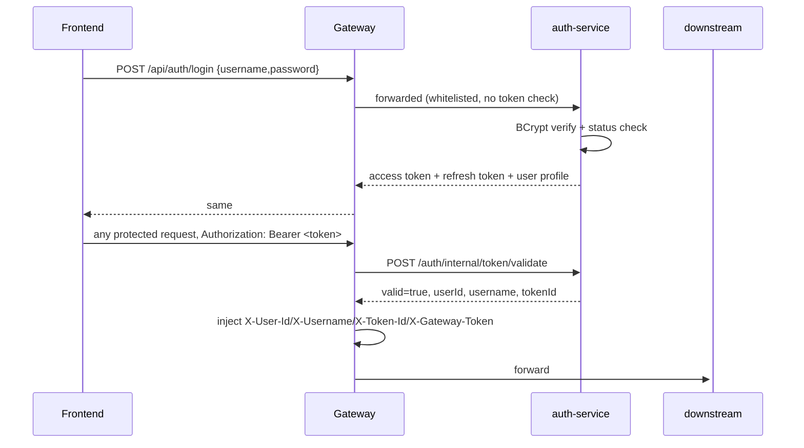
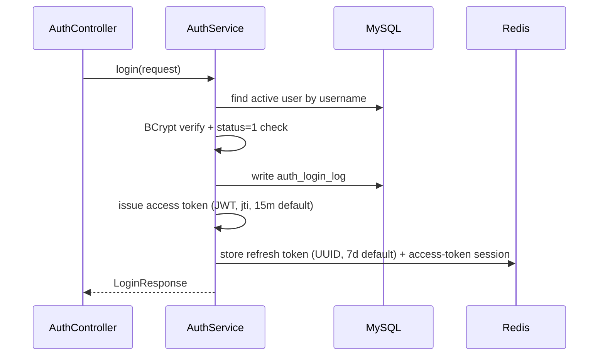
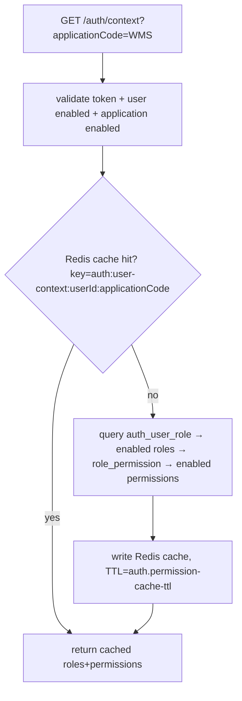

# Project Context

> Navigation + architecture + critical facts only. Implementation details live in source code.
> Last verified: 2026-08-10 (code + a live query against the running Nacos instance).

## 1. Project Responsibility

`auth-service` is the system's unified user/identity center and multi-application permission center.

**Owns:** login, logout, token issuance/refresh, current-user lookup, RBAC (User/Role/Permission/UserRole/RolePermission, scoped per `applicationCode`), the internal token-validation endpoint Gateway calls, and the permission-context endpoint other services call.

**Does NOT own:** any business logic of any consuming application (WMS or otherwise), request routing (Gateway's job), or knowledge of how a consuming service maps permission codes to its own business operations (it just hands back the code list).

## 2. Runtime

| Item | Value | Source |
|---|---|---|
| Application Name | `auth-service` | `src/main/resources/application.yaml` |
| Port | **8081** | same |
| Context Path | `/auth` | same |
| Nacos Service Name | `auth-service` | same |
| Database | MySQL, db `auth` | Nacos `auth-service-docker.yaml`/`auth-service-dev.yaml`, group `AUTH_GROUP` |
| External Dependencies | MySQL, Redis (session/blacklist/permission cache), Nacos | see §9 |
| Startup | `mvn spring-boot:run`; container: `Dockerfile`, `docker` profile | `Dockerfile` |

Matches system convention (Auth = 8081). **No CONFIGURATION CONFLICT.**

## 3. Technology Stack

Java 17, Spring Boot 3.5.8, Spring Web (MVC), MyBatis-Plus 3.5.17, MySQL, Flyway, Redis (`spring-boot-starter-data-redis`), JWT (`jjwt` 0.13.0, hand-rolled — not Spring Security OAuth2), `spring-security-crypto` (BCrypt only — **no** full Spring Security, no `SecurityFilterChain`), Knife4j/OpenAPI, Spring Cloud Alibaba Nacos.

Not present: Spring AI, PostgreSQL/pgvector, message queue.

## 4. Project Structure

```
src/main/java/com/selflearning/authservice/
  application/    "application registry" (which systems can use this identity center, e.g. WMS, AI_PLATFORM)
  auth/           core: login/logout/refresh/me/context, JWT issue/parse, Redis token store, permission-context cache, user CRUD
  role/           role CRUD + user↔role / role↔permission assignment, all scoped by applicationCode
  permission/     permission CRUD, scoped by applicationCode
  common/         ApiResponse, PageResponse, GlobalExceptionHandler, MyBatis-Plus config
```

## 5. Core Capabilities

| Capability | Status | Entry Point | Main Files |
|---|---|---|---|
| Login / logout / refresh / me | ✅ Implemented | `AuthController` | `auth/service/AuthService.java` |
| Permission context (`/auth/context`), Redis-cached | ✅ Implemented | `AuthController` | `auth/service/AuthContextService.java`, `PermissionContextCacheService.java` |
| Internal token validation (for Gateway) | ✅ Implemented | `InternalTokenController` | `auth/service/AuthService.validateInternalAccessToken` |
| User CRUD + enable/disable | ✅ Implemented | `UserController` | `auth/service/UserService.java` |
| Role CRUD + role↔permission binding | ✅ Implemented | `RoleController` | `role/service/RoleService.java`, `AuthorizationService.java` |
| Permission CRUD | ✅ Implemented | `PermissionController` | `permission/service/PermissionService.java` |
| User↔role assignment / effective permission lookup | ✅ Implemented | `UserAuthorizationController` | `role/service/AuthorizationService.java` |
| Application registry CRUD | ✅ Implemented | `ApplicationController` | `application/service/ApplicationService.java` |
| Login log | 🟡 Partial (write-only, no query API found) | — | `auth/mapper/AuthLoginLogMapper.java` |
| Captcha / login rate-limiting / password reset | ❌ Missing | — | not implemented anywhere |

## 6. API Navigation

**Gateway API = `/api` + Service API** (confirmed via Gateway's real route: `Path=/api/auth/**` + `StripPrefix=1`, see gateway-service PROJECT_CONTEXT.md §6). This is a computed mapping, not individually load-tested per endpoint.

| Capability | Method | Gateway API | Service API | Controller |
|---|---|---|---|---|
| Login | POST | `/api/auth/login` | `/auth/login` | `AuthController` |
| Current user | GET | `/api/auth/me` | `/auth/me` | `AuthController` |
| Permission context | GET | `/api/auth/context?applicationCode=` | `/auth/context?applicationCode=` | `AuthController` |
| Logout | POST | `/api/auth/logout` | `/auth/logout` | `AuthController` |
| Refresh token | POST | `/api/auth/refresh` | `/auth/refresh` | `AuthController` |
| Internal token validate | POST | not reachable from frontend (Gateway calls it directly via Nacos service discovery, not through `/api/**`) | `/auth/internal/token/validate` | `InternalTokenController` |
| User CRUD | GET/POST/PUT/PATCH/DELETE | `/api/auth/users`, `/api/auth/users/{id}`, `.../status` | `/auth/users...` | `UserController` |
| Role CRUD + permission binding | GET/POST/PUT/PATCH/DELETE | `/api/auth/applications/{code}/roles/**` | `/auth/applications/{code}/roles/**` | `RoleController` |
| Permission CRUD | GET/POST/PUT/PATCH/DELETE | `/api/auth/applications/{code}/permissions/**` | `/auth/applications/{code}/permissions/**` | `PermissionController` |
| User↔role / user permissions | GET/PUT | `/api/auth/applications/{code}/users/{id}/roles`, `.../permissions` | same, minus `/api` | `UserAuthorizationController` |
| Application registry | GET/POST/PUT/PATCH/DELETE | `/api/auth/applications/**` | `/auth/applications/**` | `ApplicationController` |

Frontend today only calls login/me/context/logout/refresh (`wms-web-refactor/src/api/auth.js`). The user/role/permission/application CRUD APIs above exist and work but have **no frontend consumer yet**.

## 7. Data Model Overview

| Table | Purpose | PK | Notes |
|---|---|---|---|
| `auth_application` | registry of systems allowed to use this identity center | id | `application_code` unique, e.g. `WMS` |
| `auth_user` | accounts | id | `username` unique, `password_hash` BCrypt, soft-deleted |
| `auth_role` | roles, scoped per application | id | unique `(application_code, role_code)` |
| `auth_permission` | permissions, scoped per application, tree via `parent_id` | id | unique `(application_code, permission_code)` |
| `auth_user_role` | user↔role, scoped per application | id | unique `(user_id, application_code, role_id)` |
| `auth_role_permission` | role↔permission, scoped per application | id | unique `(application_code, role_id, permission_id)` |
| `auth_login_log` | login attempts (success + failure) | id | write-only, see §5 |
| `auth_token_blacklist` | revoked access tokens (DB backstop for the Redis blacklist) | id | `token_id` (JWT `jti`) unique |

### RBAC Model

```mermaid
erDiagram
    AUTH_APPLICATION ||--o{ AUTH_ROLE : scopes
    AUTH_APPLICATION ||--o{ AUTH_PERMISSION : scopes
    AUTH_APPLICATION ||--o{ AUTH_USER_ROLE : scopes
    AUTH_APPLICATION ||--o{ AUTH_ROLE_PERMISSION : scopes
    AUTH_USER ||--o{ AUTH_USER_ROLE : has
    AUTH_ROLE ||--o{ AUTH_USER_ROLE : "assigned to"
    AUTH_ROLE ||--o{ AUTH_ROLE_PERMISSION : grants
    AUTH_PERMISSION ||--o{ AUTH_ROLE_PERMISSION : "granted via"
    AUTH_PERMISSION ||--o{ AUTH_PERMISSION : "parent_id (tree)"

    AUTH_APPLICATION { bigint id PK, varchar application_code UK }
    AUTH_USER { bigint id PK, varchar username UK, varchar password_hash }
    AUTH_ROLE { bigint id PK, varchar application_code FK, varchar role_code }
    AUTH_PERMISSION { bigint id PK, varchar application_code FK, varchar permission_code, bigint parent_id FK }
    AUTH_USER_ROLE { bigint id PK, bigint user_id FK, varchar application_code FK, bigint role_id FK }
    AUTH_ROLE_PERMISSION { bigint id PK, bigint role_id FK, bigint permission_id FK, varchar application_code FK }
```

A user can hold multiple roles within one `application_code`; role↔permission bindings are DB-constrained to the same `application_code` (composite FK), so cross-application binding is impossible at the schema level.

## 8. Important Business Flows

### Authentication Flow



### Login (detail)



### Permission Context (`/auth/context`) — used by wms-system's `@RequiresPermission`



## 9. Cross-Service Dependencies

| Caller → Callee | Protocol | Auth | Notes |
|---|---|---|---|
| gateway-service → auth-service | HTTP, `WebClient`, Nacos-resolved (`lb://auth-service`) | forwards client `Authorization` | `/auth/internal/token/validate` |
| wms-system → auth-service | HTTP, **fixed URL** (`auth-service.base-url`, default `http://127.0.0.1:8081/auth`) — **not** via Nacos load balancing, **not** via Gateway | forwards client `Authorization` | `/auth/context?applicationCode=WMS` — this is a normal backend-to-backend call, not a violation of "frontend can't call Auth directly" |
| Frontend → auth-service | must not happen directly (convention only — this service has no code-level block against direct access) | — | — |

## 10. Authentication / Authorization

- Token issuance: `JwtService` — HS256, claims `jti`/`sub`(userId)/`username`/`type=access`/`iss=auth-service`; access TTL 15m, refresh TTL 7d (refresh token is a random UUID stored in Redis, not itself a JWT)
- Token transport: `Authorization: Bearer <token>`
- Gateway validation: yes (delegates to this service)
- Service validation: **this is the source of truth** — signature + expiry + `type=access` + Redis blacklist + Redis session + user exists/enabled, all four checked
- User info transport: `/auth/me` and `/auth/context` both key off the `Authorization` header
- Permission decisions: "logged in or not" here; "authorized for operation X" is each consuming service's own job, matched against the code list this service returns

### Auth Domain Ownership

**Auth owns:** Authentication, User, Role, Permission, UserRole, RolePermission, RBAC (all of it — for every `applicationCode`, including WMS).
Any future code in another repo that re-implements user/role/permission management should be treated as a bug, not a legitimate parallel implementation — see WMS PROJECT_CONTEXT.md §14 for the one place this already happened (historically, now disabled).

## 11. Important Configuration

| Key | Purpose |
|---|---|
| `server.port` / `server.servlet.context-path` | 8081 / `/auth` |
| `spring.datasource.*` | MySQL connection — local/docker values differ, see profile files |
| `spring.data.redis.*` | Redis connection |
| `spring.flyway.*` | schema migration |
| `auth.jwt.issuer` / `secret` / `access-token-ttl` / `refresh-token-ttl` | JWT params (Nacos `auth-service.yaml`/`AUTH_GROUP` — same values as local profile, no drift found) |
| `auth.permission-cache-ttl` | `/auth/context` Redis cache TTL, 30m |

No passwords/secrets recorded here. Live container (`docker ps`) resolves `AUTH_DB_HOST=mysql8`, `AUTH_REDIS_HOST=auth-redis` (docker network hostnames).

## 12. Important Files

| Purpose | File |
|---|---|
| Login/logout/refresh/me/context entry | `src/main/java/com/selflearning/authservice/auth/controller/AuthController.java` |
| Gateway-facing token validation | `src/main/java/com/selflearning/authservice/auth/controller/InternalTokenController.java` |
| Core auth logic | `src/main/java/com/selflearning/authservice/auth/service/AuthService.java` |
| JWT issue/parse | `src/main/java/com/selflearning/authservice/auth/service/JwtService.java` |
| Redis token store | `src/main/java/com/selflearning/authservice/auth/service/TokenStoreService.java` |
| Permission context + cache | `src/main/java/com/selflearning/authservice/auth/service/AuthContextService.java`, `PermissionContextCacheService.java` |
| RBAC schema (authoritative) | `src/main/resources/db/migration/V1__init_auth_schema.sql` |
| Seed data (default admin, WMS/AI_PLATFORM apps) | `src/main/resources/db/migration/V2__init_default_admin.sql` |

## 13. Known Issues / Technical Debt

1. `/internal/token/validate` has no access control of its own — safety depends entirely on network isolation of port 8081.
2. wms-system reaches this service via a fixed URL, not Nacos load balancing — drifts from Gateway's approach; needs manual `AUTH_SERVICE_BASE_URL` maintenance if instances move.
3. Login log is write-only — no query API exists yet.
4. No captcha / login-rate-limiting / password-reset — flagged in case a task assumes they exist.

## 14. Historical / Deprecated Code

None. This is the from-scratch, currently-authoritative implementation — nothing here is legacy.

## 15. Modification Log

| Date | Change | Files | Context Impact |
|---|---|---|---|
| 2026-08-10 | Initial PROJECT_CONTEXT.md from code scan | — | baseline |
| 2026-08-10 | Queried live Nacos to confirm `auth-service.yaml`/`-dev`/`-docker` (`AUTH_GROUP`) content and computed Gateway API paths from the confirmed route | — (docs only) | §6/§11 confirmed |
| 2026-08-10 | Rewrote to standard PROJECT_CONTEXT template | — (docs only) | structure only |
