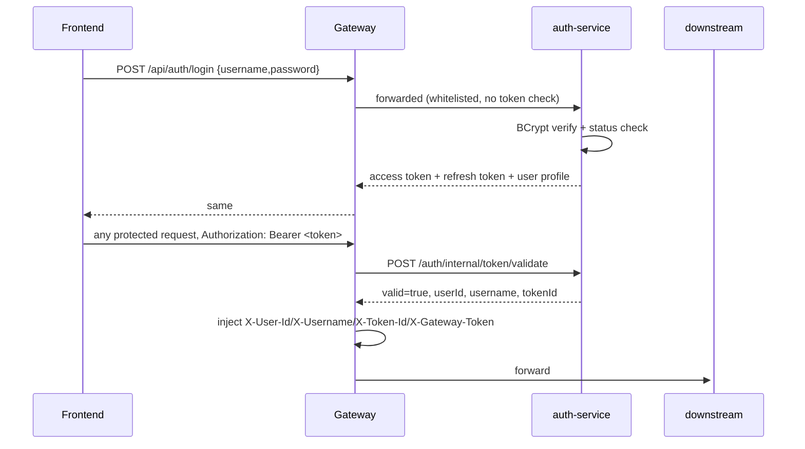
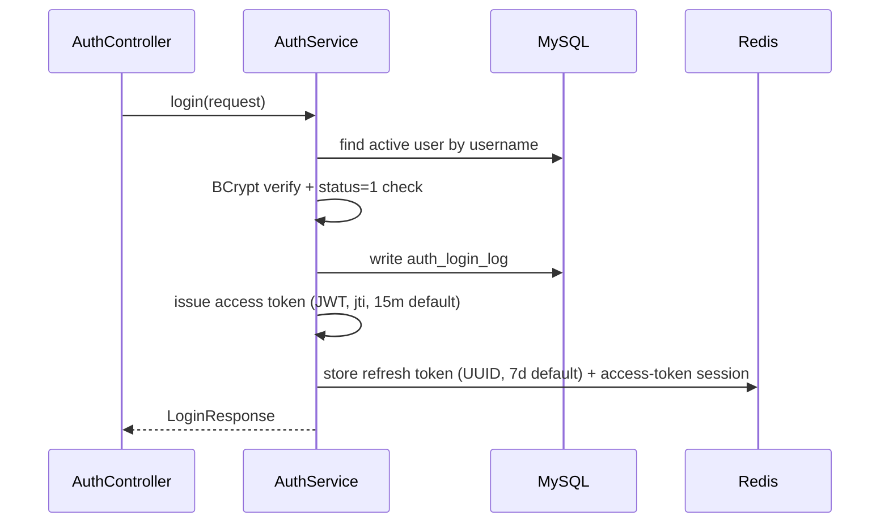
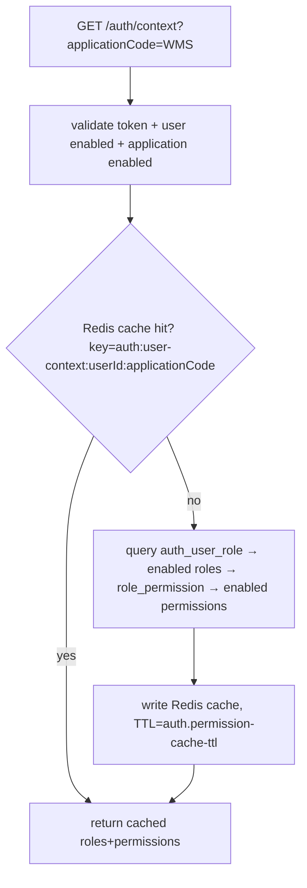
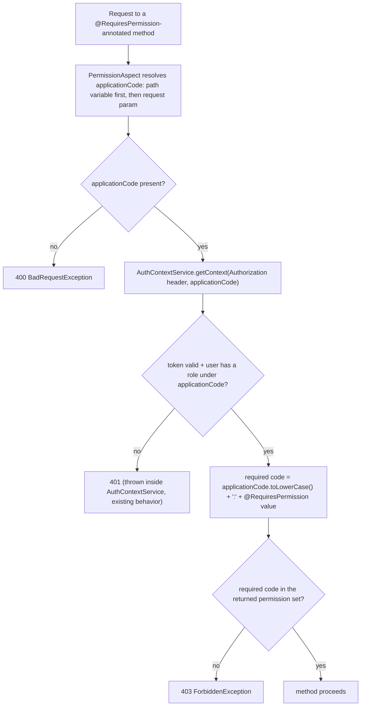

# Project Context

> Navigation + architecture + critical facts only. Implementation details live in source code.
> Last verified: 2026-08-11 (code + a live query against the running Nacos instance + a live query against the running MySQL `auth` database).
> **⚠️ Major finding (2026-08-11):** the live `auth` database's RBAC data has drifted far beyond what this repo's Flyway migrations (`V1`/`V2`) describe — see §13 item #10 before trusting "seed data" claims anywhere else in this doc (e.g. §10's "matches what's seeded in `V2__init_default_admin.sql`" language describes the *file*, not necessarily what's actually granted live).

## 1. Project Responsibility

`auth-service` is the system's unified user/identity center and multi-application permission center.

**Owns:** login, logout, token issuance/refresh, current-user lookup, RBAC (User/Role/Permission/UserRole/RolePermission, scoped per `applicationCode`), the internal token-validation endpoint Gateway calls, and the permission-context endpoint other services call.

**Does NOT own:** any business logic of any consuming application (WMS or otherwise), request routing (Gateway's job), or knowledge of how a consuming service maps permission codes to its own business operations (it just hands back the code list).

## 2. Runtime

| Item | Value | Source |
|---|---|---|
| Application Name | `auth-service` | `src/main/resources/application.yaml` |
| Port | **8081** | same |
| Context Path | `/auth` | same |
| Nacos Service Name | `auth-service` | same |
| Database | MySQL, db `auth` | Nacos `auth-service-docker.yaml`/`auth-service-dev.yaml`, group `AUTH_GROUP` |
| External Dependencies | MySQL, Redis (session/blacklist/permission cache), Nacos | see §9 |
| Startup | `mvn spring-boot:run`; container: `Dockerfile`, `docker` profile | `Dockerfile` |

Matches system convention (Auth = 8081). **No CONFIGURATION CONFLICT.**

## 3. Technology Stack

Java 17, Spring Boot 3.5.8, Spring Web (MVC), Spring AOP (`spring-boot-starter-aop`, added 2026-08-10 for `@RequiresPermission`), MyBatis-Plus 3.5.17, MySQL, Flyway, Redis (`spring-boot-starter-data-redis`), JWT (`jjwt` 0.13.0, hand-rolled — not Spring Security OAuth2), `spring-security-crypto` (BCrypt only — **no** full Spring Security, no `SecurityFilterChain`), Knife4j/OpenAPI, Spring Cloud Alibaba Nacos.

Not present: Spring AI, PostgreSQL/pgvector, message queue.

## 4. Project Structure

```
src/main/java/com/selflearning/authservice/
  application/    "application registry" (which systems can use this identity center, e.g. WMS, AI_PLATFORM)
  auth/           core: login/logout/refresh/me/context, JWT issue/parse, Redis token store, permission-context cache, user CRUD
  role/           role CRUD + user↔role / role↔permission assignment, all scoped by applicationCode
  permission/     permission CRUD, scoped by applicationCode
  common/
    web/          ApiResponse, PageResponse, GlobalExceptionHandler, exceptions (incl. ForbiddenException, added 2026-08-10)
    security/     RequiresPermission + PermissionAspect (added 2026-08-10) — server-side permission enforcement on this service's own management endpoints, see §10
    config/       MyBatis-Plus config
```

## 5. Core Capabilities

| Capability | Status | Entry Point | Main Files |
|---|---|---|---|
| Login / logout / refresh / me | ✅ Implemented | `AuthController` | `auth/service/AuthService.java` |
| Permission context (`/auth/context`), Redis-cached | ✅ Implemented | `AuthController` | `auth/service/AuthContextService.java`, `PermissionContextCacheService.java` |
| Internal token validation (for Gateway) | ✅ Implemented | `InternalTokenController` | `auth/service/AuthService.validateInternalAccessToken` |
| User CRUD + enable/disable | ✅ Implemented, **permission-gated, application-agnostic** (added 2026-08-10, generalized same day — see §10) | `UserController` | `auth/service/UserService.java`, `common/security/PermissionAspect.java` |
| Role CRUD + role↔permission binding | ✅ Implemented, **permission-gated since 2026-08-11** (`<applicationCode>:role:manage`, read from the `{applicationCode}` path variable) | `RoleController` | `role/service/RoleService.java`, `AuthorizationService.java` |
| Permission CRUD | ✅ Implemented, **read/write both permission-gated since 2026-08-11** (`<applicationCode>:permission:manage`) | `PermissionController` | `permission/service/PermissionService.java` |
| User↔role assignment / effective permission lookup | ✅ Implemented — **not permission-gated** | `UserAuthorizationController` | `role/service/AuthorizationService.java` |
| Application registry CRUD | ✅ Implemented — **not permission-gated** | `ApplicationController` | `application/service/ApplicationService.java` |
| Login log | 🟡 Partial (write-only, no query API found) | — | `auth/mapper/AuthLoginLogMapper.java` |
| Captcha / login rate-limiting / password reset | ❌ Missing | — | not implemented anywhere |

## 6. API Navigation

**Gateway API = `/api` + Service API** (confirmed via Gateway's real route: `Path=/api/auth/**` + `StripPrefix=1`, see gateway-service PROJECT_CONTEXT.md §6). This is a computed mapping, not individually load-tested per endpoint.

| Capability | Method | Gateway API | Service API | Controller |
|---|---|---|---|---|
| Login | POST | `/api/auth/login` | `/auth/login` | `AuthController` |
| Current user | GET | `/api/auth/me` | `/auth/me` | `AuthController` |
| Permission context | GET | `/api/auth/context?applicationCode=` | `/auth/context?applicationCode=` | `AuthController` |
| Logout | POST | `/api/auth/logout` | `/auth/logout` | `AuthController` |
| Refresh token | POST | `/api/auth/refresh` | `/auth/refresh` | `AuthController` |
| Internal token validate | POST | not reachable from frontend (Gateway calls it directly via Nacos service discovery, not through `/api/**`) | `/auth/internal/token/validate` | `InternalTokenController` |
| User CRUD | GET/POST/PUT/PATCH/DELETE | `/api/auth/users`, `/api/auth/users/{id}`, `.../status` — **`applicationCode` is now a required query param on every one of these** (added 2026-08-10, see §10) | `/auth/users...` | `UserController` |
| Role CRUD + permission binding | GET/POST/PUT/PATCH/DELETE | `/api/auth/applications/{code}/roles/**` | `/auth/applications/{code}/roles/**` | `RoleController` — all methods require `<code>:role:manage` (2026-08-11) |
| Permission CRUD | GET/POST/PUT/PATCH/DELETE | `/api/auth/applications/{code}/permissions/**` | `/auth/applications/{code}/permissions/**` | `PermissionController` — all methods require `<code>:permission:manage` (2026-08-11) |
| User↔role / user permissions | GET/PUT | `/api/auth/applications/{code}/users/{id}/roles`, `.../permissions` | same, minus `/api` | `UserAuthorizationController` |
| Application registry | GET/POST/PUT/PATCH/DELETE | `/api/auth/applications/**` | `/auth/applications/**` | `ApplicationController` |

Frontend today calls login/me/context/logout/refresh (`api/auth.js`), full user CRUD (`api/user.js`), full role CRUD + permission binding (`api/role.js`), and — since 2026-08-11 — full permission CRUD (`api/permission.js`, all 5 methods; `pagePermissions` is also reused read-only by the role page's permission picker — see wms-web-refactor/PROJECT_CONTEXT.md §6). Application registry CRUD (`ApplicationController`) still has **no frontend consumer**, and remains the only RBAC-management controller (besides `UserAuthorizationController`) that's neither called nor permission-gated.

**Every `page*` list endpoint enforces `pageSize` between 1 and 100 — hard 400, not a silent clamp.** Confirmed 2026-08-11 after the frontend hit this live (`RoleView.vue`'s permission picker tried `pageSize: 200`, got `400 "Page size must be between 1 and 100"`). Don't assume a bigger `pageSize` is a safe way to "get everything in one call" against any of these endpoints — callers needing the full set must page through at 100/request. Default when `pageSize` is omitted is 20.

## 7. Data Model Overview

| Table | Purpose | PK | Notes |
|---|---|---|---|
| `auth_application` | registry of systems allowed to use this identity center | id | `application_code` unique, e.g. `WMS` |
| `auth_user` | accounts | id | `username` unique, `password_hash` BCrypt, soft-deleted |
| `auth_role` | roles, scoped per application | id | unique `(application_code, role_code)` |
| `auth_permission` | permissions, scoped per application, tree via `parent_id` | id | unique `(application_code, permission_code)` |
| `auth_user_role` | user↔role, scoped per application | id | unique `(user_id, application_code, role_id)` |
| `auth_role_permission` | role↔permission, scoped per application | id | unique `(application_code, role_id, permission_id)` |
| `auth_login_log` | login attempts (success + failure) | id | write-only, see §5 |
| `auth_token_blacklist` | revoked access tokens (DB backstop for the Redis blacklist) | id | `token_id` (JWT `jti`) unique |

### RBAC Model

```mermaid
erDiagram
    AUTH_APPLICATION ||--o{ AUTH_ROLE : scopes
    AUTH_APPLICATION ||--o{ AUTH_PERMISSION : scopes
    AUTH_APPLICATION ||--o{ AUTH_USER_ROLE : scopes
    AUTH_APPLICATION ||--o{ AUTH_ROLE_PERMISSION : scopes
    AUTH_USER ||--o{ AUTH_USER_ROLE : has
    AUTH_ROLE ||--o{ AUTH_USER_ROLE : "assigned to"
    AUTH_ROLE ||--o{ AUTH_ROLE_PERMISSION : grants
    AUTH_PERMISSION ||--o{ AUTH_ROLE_PERMISSION : "granted via"
    AUTH_PERMISSION ||--o{ AUTH_PERMISSION : "parent_id (tree)"

    AUTH_APPLICATION { bigint id PK, varchar application_code UK }
    AUTH_USER { bigint id PK, varchar username UK, varchar password_hash }
    AUTH_ROLE { bigint id PK, varchar application_code FK, varchar role_code }
    AUTH_PERMISSION { bigint id PK, varchar application_code FK, varchar permission_code, bigint parent_id FK }
    AUTH_USER_ROLE { bigint id PK, bigint user_id FK, varchar application_code FK, bigint role_id FK }
    AUTH_ROLE_PERMISSION { bigint id PK, bigint role_id FK, bigint permission_id FK, varchar application_code FK }
```

A user can hold multiple roles within one `application_code`; role↔permission bindings are DB-constrained to the same `application_code` (composite FK), so cross-application binding is impossible at the schema level.

## 8. Important Business Flows

### Authentication Flow



### Login (detail)



### Permission Context (`/auth/context`) — used by wms-system's `@RequiresPermission`



## 9. Cross-Service Dependencies

| Caller → Callee | Protocol | Auth | Notes |
|---|---|---|---|
| gateway-service → auth-service | HTTP, `WebClient`, Nacos-resolved (`lb://auth-service`) | forwards client `Authorization` | `/auth/internal/token/validate` |
| wms-system → auth-service | HTTP, **fixed URL** (`auth-service.base-url`, default `http://127.0.0.1:8081/auth`) — **not** via Nacos load balancing, **not** via Gateway | forwards client `Authorization` | `/auth/context?applicationCode=WMS` — this is a normal backend-to-backend call, not a violation of "frontend can't call Auth directly" |
| Frontend → auth-service | must not happen directly (convention only — this service has no code-level block against direct access) | — | — |

## 10. Authentication / Authorization

- Token issuance: `JwtService` — HS256, claims `jti`/`sub`(userId)/`username`/`type=access`/`iss=auth-service`; access TTL 15m, refresh TTL 7d (refresh token is a random UUID stored in Redis, not itself a JWT)
- Token transport: `Authorization: Bearer <token>`
- Gateway validation: yes (delegates to this service)
- Service validation: **this is the source of truth** — signature + expiry + `type=access` + Redis blacklist + Redis session + user exists/enabled, all four checked
- User info transport: `/auth/me` and `/auth/context` both key off the `Authorization` header
- Permission decisions: "logged in or not" here; "authorized for operation X" is each consuming service's own job, matched against the code list this service returns — **except for this service's own RBAC-management endpoints, where it now also plays that "consuming service" role against itself, see below**

### Server-side permission enforcement on this service's own endpoints (added 2026-08-10, generalized same day, extended 2026-08-11)

`common/security/RequiresPermission.java` + `PermissionAspect.java` mirror wms-system's `@RequiresPermission`/`PermissionAspect` pattern, but resolve permissions **in-process** via `AuthContextService` (the same code path `GET /auth/context` uses, including its Redis cache) instead of an HTTP round-trip — this service already *is* the identity source of truth, so there's no reason to call itself over the network.

**Not application-specific.** The first version hardcoded `applicationCode="WMS"` inside the aspect; that was replaced the same day because the user explicitly said auth-service shouldn't be WMS-only (a future AI platform is planned). The current design:

- `@RequiresPermission("user:manage")` (or `"role:manage"`, `"permission:manage"`, ...) on a controller method holds an **action code**, not a full permission code
- `applicationCode` is resolved per-request from **either** of two sources (in this order): a `{applicationCode}` path variable (`RoleController`, `PermissionController` — read via `HandlerMapping.URI_TEMPLATE_VARIABLES_ATTRIBUTE`, since path variables aren't visible through `HttpServletRequest.getParameter()`), or an `applicationCode` request parameter (`UserController`, which has no natural path segment for it since users are a global resource). No default either way — missing it is a 400.
- `PermissionAspect` builds the actual permission code to check as `applicationCode.toLowerCase() + ":" + value()` — e.g. `applicationCode=WMS` + `"role:manage"` → checks for `wms:role:manage`, which happens to already match what's seeded in `V2__init_default_admin.sql`, so WMS needed zero DB changes
- A future application (e.g. an AI platform) calling any of these endpoints would pass its own `applicationCode` and would need its own `<code>:<action>` permission seeded and granted — this endpoint doesn't create that for you, it only checks



**Currently applied to:**
- every `UserController` endpoint — action code `user:manage` (`applicationCode` via request param)
- every `RoleController` endpoint, including the role↔permission binding ones — action code `role:manage` (`applicationCode` via path variable)
- every `PermissionController` endpoint — action code `permission:manage` (`applicationCode` via path variable). Gated mainly because `RoleView.vue`'s permission-assignment UI needs to list permissions to check against — read and write both share the one code, there's no separate "view-only" permission in the current seed data, same coarse granularity as everything else here.

**Still not applied to:** `UserAuthorizationController`, `ApplicationController` — neither has a frontend consumer yet. `ApplicationController` (the application registry itself) has no natural `applicationCode` to scope by at all — that one needs its own design decision when it matters, not a default.

### Auth Domain Ownership

**Auth owns:** Authentication, User, Role, Permission, UserRole, RolePermission, RBAC (all of it — for every `applicationCode`, including WMS).
Any future code in another repo that re-implements user/role/permission management should be treated as a bug, not a legitimate parallel implementation — see WMS PROJECT_CONTEXT.md §14 for the one place this already happened (historically, now disabled).

## 11. Important Configuration

| Key | Purpose |
|---|---|
| `server.port` / `server.servlet.context-path` | 8081 / `/auth` |
| `spring.datasource.*` | MySQL connection — local/docker values differ, see profile files |
| `spring.data.redis.*` | Redis connection |
| `spring.flyway.*` | schema migration |
| `auth.jwt.issuer` / `secret` / `access-token-ttl` / `refresh-token-ttl` | JWT params (Nacos `auth-service.yaml`/`AUTH_GROUP` — same values as local profile, no drift found) |
| `auth.permission-cache-ttl` | `/auth/context` Redis cache TTL, 30m |

No passwords/secrets recorded here. Live container (`docker ps`) resolves `AUTH_DB_HOST=mysql8`, `AUTH_REDIS_HOST=auth-redis` (docker network hostnames).

## 12. Important Files

| Purpose | File |
|---|---|
| Login/logout/refresh/me/context entry | `src/main/java/com/selflearning/authservice/auth/controller/AuthController.java` |
| Gateway-facing token validation | `src/main/java/com/selflearning/authservice/auth/controller/InternalTokenController.java` |
| Core auth logic | `src/main/java/com/selflearning/authservice/auth/service/AuthService.java` |
| JWT issue/parse | `src/main/java/com/selflearning/authservice/auth/service/JwtService.java` |
| Redis token store | `src/main/java/com/selflearning/authservice/auth/service/TokenStoreService.java` |
| Permission context + cache | `src/main/java/com/selflearning/authservice/auth/service/AuthContextService.java`, `PermissionContextCacheService.java` |
| RBAC schema (authoritative) | `src/main/resources/db/migration/V1__init_auth_schema.sql` |
| Seed data (default admin, WMS/AI_PLATFORM apps) — **describes only a small fraction of the live data, see §13 item #10** | `src/main/resources/db/migration/V2__init_default_admin.sql` |
| Adds `sku:delete` permission, granted to `ADMIN`/`DEVELOPER` (added 2026-08-11) | `src/main/resources/db/migration/V3__add_wms_sku_permissions.sql` |
| Adds `warehouse:delete` permission, granted to `ADMIN`/`DEVELOPER` (added 2026-08-11) | `src/main/resources/db/migration/V4__add_wms_warehouse_delete_permission.sql` |
| Adds `supplier:delete` permission, granted to `ADMIN`/`DEVELOPER` (added 2026-08-11) | `src/main/resources/db/migration/V5__add_wms_supplier_delete_permission.sql` |
| Permission annotation + enforcement (added 2026-08-10) | `src/main/java/com/selflearning/authservice/common/security/RequiresPermission.java`, `PermissionAspect.java` |
| Forbidden (403) exception + handler (added 2026-08-10) | `src/main/java/com/selflearning/authservice/common/web/ForbiddenException.java`, `GlobalExceptionHandler.java` |
| Required API implementation standard for any new/refactored endpoint | `API_IMPLEMENTATION_STANDARD.md` |
| Required testing standard for any new/refactored auth-service code | `TESTING_STANDARD.md` |

### API Implementation Standard

Full standard: **[API_IMPLEMENTATION_STANDARD.md](API_IMPLEMENTATION_STANDARD.md)** — read this before adding or refactoring any auth-service endpoint. New APIs in this repo must follow it for package placement, `ApiResponse`/`PageResponse` shape, `applicationCode` scoping, `@RequiresPermission` usage, and RBAC/cache/migration side effects.

### Testing Standard

Full standard: **[TESTING_STANDARD.md](TESTING_STANDARD.md)** — read this before adding or refactoring any auth-service controller, service, permission, cache, or migration-adjacent code. New work in this repo must follow it for the default JUnit+Mockito test style, the minimum happy-path/failure-path/side-effect coverage, and the known `AuthServiceApplicationTests.contextLoads` baseline caveat.

## 13. Known Issues / Technical Debt

1. `/internal/token/validate` has no access control of its own — safety depends entirely on network isolation of port 8081.
2. wms-system reaches this service via a fixed URL, not Nacos load balancing — drifts from Gateway's approach; needs manual `AUTH_SERVICE_BASE_URL` maintenance if instances move.
3. Login log is write-only — no query API exists yet.
4. No captcha / login-rate-limiting / password-reset — flagged in case a task assumes they exist.
5. ~~`UserController`/`RoleController`/`PermissionController`/`ApplicationController` have no permission check of their own~~ **Fixed for three of the four (2026-08-10 for `UserController`, generalized + extended to `RoleController`/`PermissionController` on 2026-08-11)**: all now require `<applicationCode>:<action>` via `PermissionAspect`, `applicationCode` supplied by the caller — request param for `UserController`, path variable for the other two (see §10). `UserAuthorizationController`/`ApplicationController` are **still unprotected** — deliberately, not an oversight (see §10 for why). Don't assume they're gated.
6. If a future application calls any of the now-gated endpoints with an `applicationCode` that doesn't have the matching `<code>:<action>` permission seeded and granted to its caller yet, every request will 403. That's correct fail-closed behavior, not a bug — but it means "wire up a new application to user/role/permission management" requires a Flyway migration seeding that permission (and a role granting it) *before* that application's frontend can use these endpoints, not just a frontend change.
7. `AuthServiceApplicationTests.contextLoads` fails in this environment (`No spring.config.import set` — the Nacos-backed config import can't resolve during a bare `@SpringBootTest`) — confirmed pre-existing via `git stash` before any 2026-08-10 changes, not something introduced here. All other tests pass.
8. `PermissionController`'s read endpoints (`GET`) and write endpoints (create/update/delete) share the same `permission:manage` gate — there's no lighter "can view permissions" code separate from "can manage permissions" in the current seed data. Anyone who can see the permission picker in `RoleView.vue` could, in principle, also call the write endpoints directly (frontend just doesn't expose UI for it). Not a new gap introduced here, just carried forward from the existing coarse permission granularity.
9. **Pagination validation (`normalizePageSize`, `DEFAULT_PAGE_SIZE=20`/`MAX_PAGE_SIZE=100`, and the `"Page size must be between 1 and 100"` message) is copy-pasted identically into four places**: `UserService`, `RoleService`, `PermissionService`, `ApplicationService` — confirmed by direct inspection, no shared pagination utility exists anywhere in this codebase. They're kept in sync only by convention, not by the compiler. If one gets changed (e.g. raising the cap) without updating the other three, behavior will silently diverge between endpoints. Worth extracting into a shared helper next time any of the four is touched — not urgent enough to do speculatively on its own.
10. **The live `auth` database's RBAC data has drifted far beyond what Flyway migration files in this repo describe — discovered 2026-08-11 while adding one permission (`sku:delete`) for wms-system's SKU page.** `V1__init_auth_schema.sql` defines the schema; `V2__init_default_admin.sql` seeds exactly 8 permission codes, 2 roles (`WMS_ADMIN`, `AI_ADMIN`), and 1 user (`admin`, on `WMS_ADMIN`). None of that matches the live database:
   - **74 permission codes** exist under `application_code='WMS'` (vs. 4 WMS ones in `V2`) — things like `customer:view`/`create`/`update`/`disable`/`delete`, `sys-dict:*`, and now `sku:*`, none introduced by any migration file before `V3` (added this session).
   - **6 roles** exist under `WMS`: `WMS_ADMIN`, `DEVELOPER`, `ADMIN`, `WAREHOUSE_MANAGER`, `WAREHOUSE_OPERATOR`, `INVENTORY_VIEWER` — only `WMS_ADMIN` is in `V2`.
   - **245 `auth_role_permission` rows** bind those roles to those permissions — zero of them are in any migration file.
   - **The real `admin` user's active role is `ADMIN`, not `WMS_ADMIN`.** `WMS_ADMIN` (the only role `V2` actually seeds and the only one `V2` grants to `admin`) currently has **zero** permissions bound to it live. If migrations were ever replayed onto a fresh database (`flyway clean` + migrate, a new environment, a test DB), the resulting `admin` user would be a member of a role with no permissions at all and every `@RequiresPermission`-gated call would 403 — the app would look broken with no code change.
   - Root cause is unknown (no migration file or commit captures how the live data reached this state — most plausible explanation is direct DB writes or a since-lost migration/seed script that ran outside Flyway's tracking, but this is not confirmed). This doc does not attempt to retroactively author migrations for all 245 bindings (out of scope for the SKU task that surfaced this) — `V3__add_wms_sku_permissions.sql` only closes the one gap that blocked that task (`sku:delete`) and documents this finding inline.
   - **Practical implication for anyone touching RBAC here:** never trust this repo's migration files (or this doc's descriptions of "seeded" data) as a description of what's actually granted in the running system — query the live `auth_permission`/`auth_role`/`auth_role_permission` tables directly first. Same warning applies from the WMS side — see wms-system `PROJECT_CONTEXT.md` §13 item #5.

## 14. Historical / Deprecated Code

None. This is the from-scratch, currently-authoritative implementation — nothing here is legacy.

## 15. Modification Log

| Date | Change | Files | Context Impact |
|---|---|---|---|
| 2026-08-10 | Initial PROJECT_CONTEXT.md from code scan | — | baseline |
| 2026-08-10 | Queried live Nacos to confirm `auth-service.yaml`/`-dev`/`-docker` (`AUTH_GROUP`) content and computed Gateway API paths from the confirmed route | — (docs only) | §6/§11 confirmed |
| 2026-08-10 | Rewrote to standard PROJECT_CONTEXT template | — (docs only) | structure only |
| 2026-08-10 | Noted (while implementing frontend permission gating) that user/role/permission/application CRUD endpoints have no server-side permission check | — (docs only, no code change here) | §13 new item #5 — real security-boundary work would need to happen in this service |
| 2026-08-10 | Added `PermissionAspect` + `@RequiresPermission` (in-process, reuses `AuthContextService`) and applied it to `UserController` (`wms:user:manage`); added `spring-boot-starter-aop` dependency and `ForbiddenException`/403 handling. Verified: `mvn compile` succeeds, `mvn test` — all pass except the pre-existing-broken `AuthServiceApplicationTests.contextLoads` (confirmed pre-existing via `git stash -u` + re-run on the unmodified tree) | `pom.xml`, `common/security/RequiresPermission.java` (new), `common/security/PermissionAspect.java` (new), `common/web/ForbiddenException.java` (new), `common/web/GlobalExceptionHandler.java`, `auth/controller/UserController.java` | §3/§4/§5/§6/§10/§12/§13 updated; `RoleController`/`PermissionController`/`UserAuthorizationController`/`ApplicationController` remain intentionally unprotected (§10 explains why) |
| 2026-08-10 | User explicitly asked that this not be WMS-locked (an AI platform is planned next). Reworked the same day: `@RequiresPermission` now holds an action code (`user:manage`, not `wms:user:manage`); `PermissionAspect` requires an `applicationCode` request parameter (no default) and builds `applicationCode.toLowerCase() + ":" + value` as the code to check; `UserController`'s 6 endpoints all gained a required `applicationCode` parameter. `wms-web-refactor/src/api/user.js` updated to send `applicationCode: 'WMS'` on every call (unaffected on the wire since it resolves to the same `wms:user:manage` check as before). Verified: `mvn clean compile` + `mvn test` (18/18 pass, same pre-existing `AuthServiceApplicationTests` exclusion) | `common/security/RequiresPermission.java`, `common/security/PermissionAspect.java`, `auth/controller/UserController.java` (auth-service); `src/api/user.js` (wms-web-refactor) | §6/§10/§13 updated; documented what a second application needs to do (seed + grant its own `<code>:user:manage`) to use this endpoint |
| 2026-08-11 | Built the WMS frontend's role management page, which needed `RoleController`/`PermissionController` to actually be gated (they weren't yet). Extended `PermissionAspect` to resolve `applicationCode` from a `{applicationCode}` path variable (via `HandlerMapping.URI_TEMPLATE_VARIABLES_ATTRIBUTE`) in addition to the existing request-parameter fallback; applied `@RequiresPermission("role:manage")` to all 8 `RoleController` endpoints and `@RequiresPermission("permission:manage")` to all 5 `PermissionController` endpoints. Verified: `mvn clean compile` + `mvn test` (18/18 pass, same pre-existing exclusion) | `common/security/PermissionAspect.java`, `role/controller/RoleController.java`, `permission/controller/PermissionController.java` | §5/§6/§10/§13 updated; `UserAuthorizationController`/`ApplicationController` remain the only unprotected RBAC-management endpoints |
| 2026-08-11 | No code change in this repo — documented, while fixing a frontend bug, that `pageSize` is hard-capped at 1–100 on every list endpoint (confirmed by reading `PermissionService`/`RoleService`/`UserService`/`ApplicationService`), and that the cap-enforcing logic is duplicated identically in all four services with no shared utility | — (docs only) | §6/§13 updated (new item #9 on the duplication) |
| 2026-08-11 | No code change in this repo — the WMS frontend built a full permission-management page against `PermissionController`'s existing (already-gated) CRUD; also confirmed by reading `PermissionService.deletePermission` that deletes are soft (`deleted=true`) and don't clean up `auth_role_permission` bindings | — (docs only) | §6 updated: frontend now consumes full permission CRUD, not just the read endpoint |
| 2026-08-11 | While adding a `sku:delete` permission for wms-system's new SKU delete endpoint, discovered the live `auth` database's RBAC state has drifted massively from what `V1`/`V2` migrations describe (74 permission codes vs. 4, 6 roles vs. 1, 245 role-permission bindings vs. what `V2` grants, `admin` user's real role being `ADMIN` not `WMS_ADMIN`, and `WMS_ADMIN` itself having zero permissions live). Added `V3__add_wms_sku_permissions.sql` (inserts `sku:delete`, grants it to `ADMIN`/`DEVELOPER` following the observed delete-permission pattern) and applied it directly to the live database; also manually evicted the stale Redis cache key `auth:user-context:1:WMS` so the grant took effect immediately instead of waiting out the 30-minute TTL. Verified via direct SQL query after applying (not just "should have worked") | `src/main/resources/db/migration/V3__add_wms_sku_permissions.sql` (new); live `auth` DB; live Redis (`auth-redis`) | §13 new item #10 (flagged prominently at top of doc); §12 updated |
| 2026-08-11 | Same pattern, same day, second occurrence: wms-system's new Warehouse delete endpoint needed `warehouse:delete`, which existed nowhere (create/view/update/disable did, delete didn't — confirmed live before writing the migration, following item #10's own advice). Added `V4__add_wms_warehouse_delete_permission.sql`, granted to `ADMIN`/`DEVELOPER` only (checked the live grant pattern for `warehouse:*` first, same as `sku:*`). Applied directly to live `auth` DB and re-verified via SQL; evicted `auth:user-context:1:WMS` from Redis again | `src/main/resources/db/migration/V4__add_wms_warehouse_delete_permission.sql` (new); live `auth` DB; live Redis (`auth-redis`) | §12 updated |
| 2026-08-11 | Third occurrence of the same pattern: wms-system's new Supplier delete endpoint needed `supplier:delete`. Added `V5__add_wms_supplier_delete_permission.sql`, granted to `ADMIN`/`DEVELOPER` only. Applied directly to live `auth` DB and re-verified via SQL; evicted `auth:user-context:1:WMS` from Redis again. This is now a well-worn pattern — see §13 item #10 before assuming any `*:create`/`*:view`/`*:update`/`*:disable` set implies a matching `*:delete` already exists | `src/main/resources/db/migration/V5__add_wms_supplier_delete_permission.sql` (new); live `auth` DB; live Redis (`auth-redis`) | §12 updated |
| 2026-08-11 | No code change in this repo — added `API_IMPLEMENTATION_STANDARD.md` and wired `PROJECT_CONTEXT.md` to require reading it before adding/refactoring any auth-service endpoint, so future agents land on the existing controller/service/permission/cache conventions instead of improvising a second API style | `API_IMPLEMENTATION_STANDARD.md` (new), `PROJECT_CONTEXT.md` | §12 updated |
| 2026-08-11 | No code change in this repo — added `TESTING_STANDARD.md` and wired `PROJECT_CONTEXT.md` to require it before any new/refactored auth-service code, so future agents inherit the repo's actual testing reality (Mockito-heavy service tests first, not blanket Spring context tests) and explicitly account for the known `contextLoads`/Flyway caveats when reporting verification | `TESTING_STANDARD.md` (new), `PROJECT_CONTEXT.md` | §12 updated |
